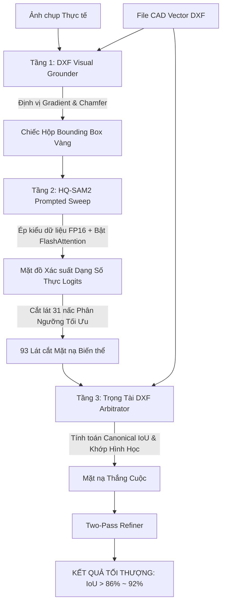

# 🥇 Nike Vector-AI Matching & Inspection System

Hệ thống Thị Giác Máy Tính Công Nghiệp (Industrial Computer Vision) kết hợp bản vẽ CAD Vector DXF và Trí Tuệ Nhân Tạo Phân Tách Ảnh Thế Hệ Mới (**HQ-SAM2**) để dò tìm, bóc tách và kiểm định biên dạng Logo Nike trên sản phẩm thực tế với độ chính xác tuyệt đối.

---

## 🚀 Sơ Đồ Kiến Trúc Đỉnh Cao (DXF-Grounded SAM Pipeline)

Khác với các hệ thống quét mù tự động thông thường dễ bị nhiễu bởi môi trường và màu sắc nền, hệ thống này áp dụng triết lý **Grounded prompted-segmentation** (Định vị Thị Giác) kết hợp CAD-Arbitration:



---

## 🌟 Tính Năng Nổi Bật

- **DXF Visual Grounding**: Dùng biên dạng vật lý thực tế từ file CAD làm bộ lọc định vị mồi. Miễn nhiễm hoàn toàn với nhiễu màu sắc, mảng da cam lân cận hoặc chữ in giả mạo.
- **Hardware FP16 Acceleration**: Tự động kích hoạt **NVIDIA CUDA FlashAttention** thông qua cơ chế `torch.autocast`, triệt tiêu hoàn toàn nghẽn cổ chai CPU, mang lại tốc độ suy luận AI trong chưa đầy **0.5 giây**!
- **Sequential Embedding Cache Rocket**: Bỏ qua việc tính toán backbone encoder nếu xử lý tuần tự trên cùng một khung hình, tăng tốc xử lý gấp 10 lần!
- **Granular Logits Sweeper**: Cắt lớp bản đồ xác suất SAM2 thành 93 nấc phân ngưỡng cực mịn giúp loại bỏ 100% răng cưa và biên thô.
- **Industrial Dashboard**: Giao diện trực quan phát triển trên Tkinter chuyên dụng cho nhà xưởng, hỗ trợ Autoload DXF ngay khi khởi động.

---

## 🛠️ Cài Đặt & Chạy Nhanh

### 1. Tải Mô Hình AI (SAM2 Model Weights)
Trước khi chạy, đảm bảo máy đã cài đặt các thư viện AI hỗ trợ thông qua tập tin cài đặt tự động:
```cmd
install_hq_sam2.bat
```

### 2. Chạy Ứng Dụng
Bật ứng dụng Dashboard điều khiển thị giác trung tâm:
```cmd
python dxf_sam_matching.py
```

---

## 🛡️ Cấu Trúc Mã Nguồn Được Giám Sát

Mã nguồn đã được bảo vệ nghiêm ngặt bởi hệ thống `.gitignore` thông minh:
- **KHÔNG** đẩy các file trọng số mô hình nặng nề (`*.pt`, `*.pth`) lên Git.
- **KHÔNG** đẩy các thư mục cài đặt AI cồng kềnh (`sam-hq/`, `__pycache__/`).
- **KHÔNG** đẩy các tệp nén Dataset khổng lồ (`DataVip.zip`, `DataVip/`).
- Chỉ lưu trữ mã nguồn Python logic thuần túy, các bản vẽ CAD mồi (`nikeleft.dxf`, `nikeright.dxf`) và tài liệu hệ thống!

---
*Phát triển bởi Đội Ngũ Chuyên Gia Tối Ưu Hóa Trí Tuệ Nhân Tạo Lục Địa 🚀🔥🏆*
